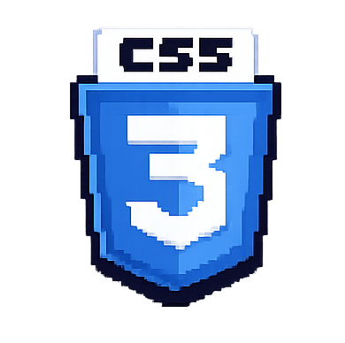

##  **| Diogo Cristovam | Arctic |** 

>## **Junior Full Stack Developer**

>#### Portuguese 🇧🇷 /English 🇺🇸

Yo! My name is Diogo, or Arctic for friends. I am from Mato Grosso, Brazil, and currently studying the 1st semester at IFMT (Federal Institute of Mato Grosso) in the Technology in Systems Analysis and Development program.

I have been passionate about technology since I was 5 years old, when I received my first console and desktop computer. Since then, I have felt that this is what I was made for. Technology excites me and generates deep interest in **many different fields**.

Because of this, I am determined to become a **Full Stack Developer**, exploring areas such as:

**Data Science • Web Development • Systems Analysis • Cybersecurity • Automation • and many other fields in technology.**

 

&nbsp;&nbsp;&nbsp;&nbsp;&nbsp;&nbsp; 

## __Programming Languages:__

                    